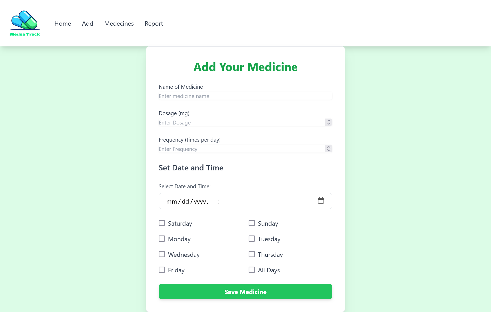
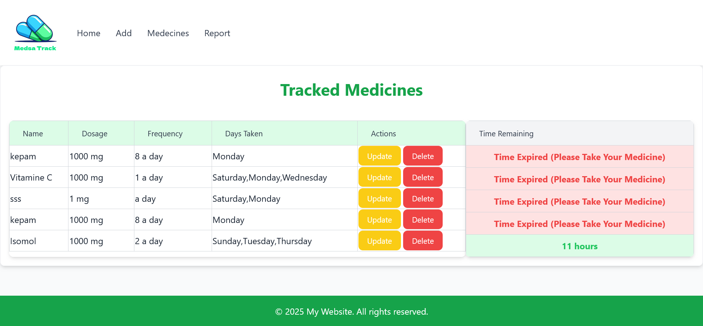
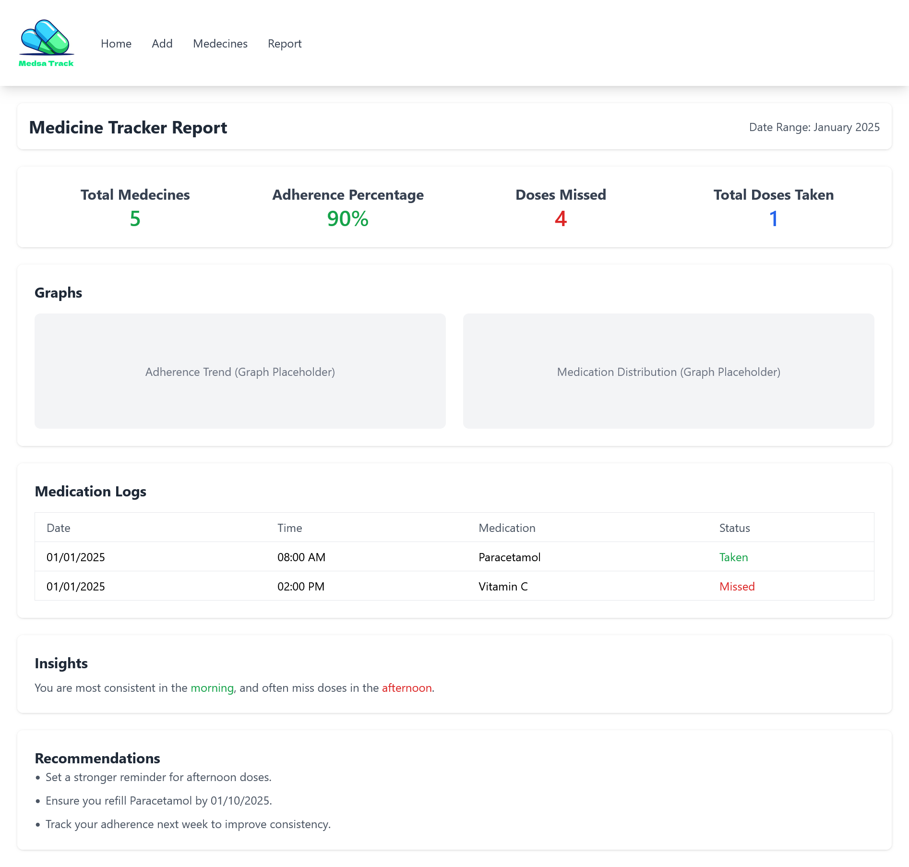

# Medicine Dose Tracker 💊

A web application that helps users track their medicine doses, set reminders, and manage their medication schedule efficiently.

## 🚀 Features
- 📋 **User Authentication** (Register/Login)
- ⏰ **Dose Reminders** (Track and schedule medicines)
- 📅 **Daily/Weekly Medicine Schedule**
- 📝 **Medicine Management** (Add, edit, delete medicines)
- 📊 **Dashboard for Tracking Doses**
- 🌐 **Responsive UI with EJS Templates**

## 🛠️ Tech Stack
- **Backend**: Node.js, Express.js
- **Frontend**: EJS (Embedded JavaScript Templates)
- **Database**: MongoDB (Mongoose ODM)
- **Authentication**: Passport.js (or JWT if applicable)
- **Styling**: Bootstrap / Tailwind CSS (if used)

---

## 📌 Installation Guide

###  Clone the Repository
```bash
git clone https://github.com/yourusername/medicine-dose-tracker.git
cd medicine-dose-tracker
```


### Install Dependencies
```bash
npm install
```

### Start Application
```bash
nodemon server.js
```

### Screenshots



